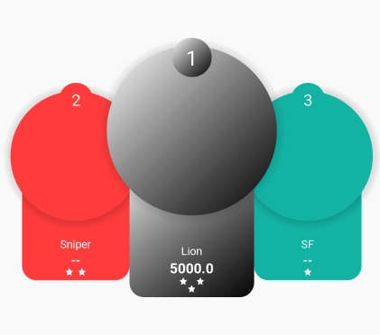

#Top3View
I wrote a custom view for [Chur](https://play.google.com/store/apps/details?id=com.churinc.app.android.lite).

It allows you to set several properties to show a ranking and it looks like the gif below:

